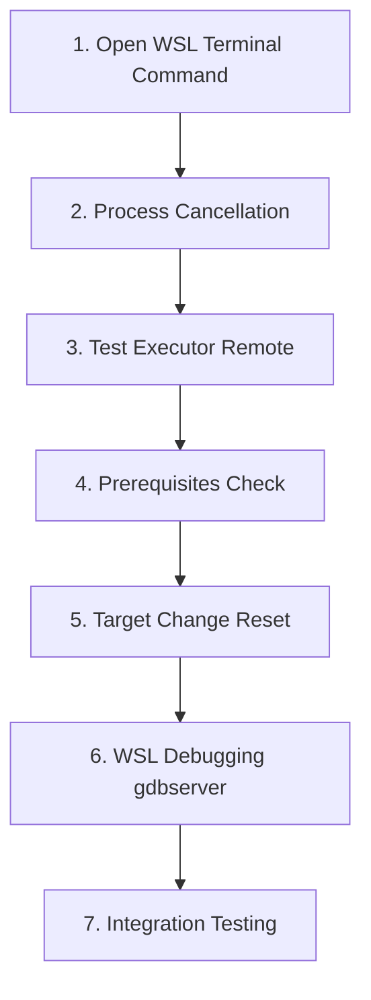

# WSL Full Support Implementation Plan

## Current State Analysis

The codebase already has substantial WSL infrastructure in place (Phase R0-R2 mostly complete):

**Implemented:**

- Core abstractions: `RemotePath`, `TargetKind`, `IExecutionContext`, `IPathMapper`, `ITargetSystemService`
- WSL-specific: `WslExecutionContext`, `WslPathMapper`, `WslTargetSystem`
- Feature flags: `EnableWslSupport` in [Options.cs](src/RustAnalyzer/Infrastructure/Options.cs)
- Build/Clean/Fmt/Clippy: Remote execution in [ToolchainService.cs](src/RustAnalyzer.TestAdapter/Cargo/ToolchainService.cs)
- LSP: `RustAnalyzerMiddleLayer` for URI rewriting, remote rust-analyzer startup
- Target system UI: Combo dropdown with persistence in [TargetSystemCommands.cs](src/RustAnalyzer/Shell/TargetSystemCommands.cs)

**Gaps to Address:**

### 1. Test Executor - Remote Test Execution (HIGH PRIORITY)

[TestExecutor.cs](src/RustAnalyzer.TestAdapter/TestExecutor.cs) lines 107-145 run test executables locally via `ProcessRunner`. Need remote execution path.

```csharp
// Current: Runs locally
using var testExeProc = await ProcessRunner.RunWithLogging(exe, args, exe.GetDirectoryName(), envDict, ct, tl.L, @throw: false);
```

**Changes Required:**

- Add `IWorkspaceContextAccessor` to `TestExecutor`
- Get execution context and path mapper from current target
- Map test executable path to remote path
- Execute via `IExecutionContext.ExecuteAsync()` instead of `ProcessRunner`

### 2. WSL Debugging with gdbserver/MIEngine (HIGH PRIORITY)

[DebugLaunchTargetProvider.cs](src/RustAnalyzer/Debugger/DebugLaunchTargetProvider.cs) lines 271-333 wraps `wsl.exe` with native debugger. This doesn't provide full debugging - need gdbserver.

**Changes Required:**

- Detect if gdbserver is installed in WSL (prereqs check)
- Start gdbserver on WSL side: `wsl.exe -d <distro> -- gdbserver :1234 <binary> <args>`
- Use MIEngine to connect from VS to gdbserver
- Implement source path mapping for breakpoints
- Handle WSL2 networking (may need IP detection via `hostname -I`)

### 3. WSL Process Cancellation with Process Groups

[WslExecutionContext.cs](src/RustAnalyzer.Remote/WslExecutionContext.cs) doesn't implement `setsid` + `pkill` pattern per the plan (Decision 4). Killing `wsl.exe` doesn't kill child processes.

**Changes Required:**

- Add `setsid --fork` to command execution
- Track remote PGID
- On cancellation, run `pkill -TERM -g <pgid>` then `pkill -KILL -g <pgid>`

### 4. Target Change State Reset

When user changes target in dropdown, need full state reset (per Decision 8 in ARCHITECTURE.md):

**Changes Required:**

- Subscribe to `TargetSystemService.TargetChanged` event
- Stop rust-analyzer: `_languageClient.StopServerAsync()`
- Clear MetadataService cache
- Invalidate test containers: `TestContainerDiscoverer.InvalidateAllContainers()`
- Clear Error List diagnostics
- Check prerequisites for new target

### 5. Prerequisites Check for WSL

Need to verify WSL environment has required tools before operations.

**Changes Required:**

- Update [PreReqsCheckService.cs](src/RustAnalyzer/Infrastructure/PreReqsCheckService.cs) to check WSL:
  - `cargo` exists in WSL
  - `rustup` exists in WSL
  - `rust-analyzer` exists in WSL
  - `gdbserver` exists (for debugging)
- Show actionable error messages if missing

### 6. Windows-Specific Code Cleanup

Several files have Windows assumptions that need review:

| File | Issue | Fix |

|------|-------|-----|

| [Constants.cs](src/RustAnalyzer.TestAdapter/Constants.cs) | `CargoExe = "cargo.exe"` | Already handled by `IExecutionContext.CargoCommand` |

| [ToolchainService.cs](src/RustAnalyzer.TestAdapter/Cargo/ToolchainService.cs) L23 | Windows test exe regex | Already has `TestExecutablePathCrackerRemote` |

| [DebugLaunchTargetProvider.cs](src/RustAnalyzer/Debugger/DebugLaunchTargetProvider.cs) L21 | `new[] { ".exe" }` export | Need to also handle no extension for WSL |

| [TestExecutor.cs](src/RustAnalyzer.TestAdapter/TestExecutor.cs) L115 | `LaunchProcessWithDebuggerAttached` | Won't work for WSL binaries |

| [PathExExtensions.cs](src/RustAnalyzer.Remote/Common/PathExExtensions.cs) L13 | `File.Exists` for WSL | UNC paths work, but should verify |

### 7. Test Container Discovery for WSL

Test containers are generated after build. For WSL:

- Test binary paths should be UNC paths (`\\wsl$\...`)
- Container files generated locally in `.vs` folder
- [ToolchainService.cs](src/RustAnalyzer.TestAdapter/Cargo/ToolchainService.cs) L473-477 already maps remote paths to local

**Verify:** Ensure `TestContainer.TestExes` contains valid UNC paths that VS Test Explorer can navigate to.

### 8. "Open WSL Terminal Here" Context Menu (HIGH PRIORITY - Developer Experience)

Add a right-click context menu option on folders in Solution Explorer to open a WSL terminal at that location. This is critical for developers who need to run cargo commands directly.

**Implementation:**

1. **Add Command Definition in VSCommandTable.vsct:**

   - New button `IdOpenWslTerminal` in `guidRustAnalyzerPackage`
   - Place in `idgWSE_ContextMenu_ShellActions` group (alongside "Open Command Prompt" etc.)
   - Icon: Use `Terminal` from ImageCatalogGuid

2. **Create Command Handler:**

   - New file: `src/RustAnalyzer/Shell/OpenWslTerminalCommand.cs`
   - Get selected folder path from Solution Explorer context
   - Map UNC path to Linux path: `\\wsl$\Ubuntu\home\user\project` -> `/home/user/project`
   - Extract distro name from path
   - Launch: `wsl.exe -d <distro> --cd <linux-path>`

3. **Visibility Logic:**

   - Only show when:
     - WSL support is enabled in Options
     - Selected item is a folder
     - Path is a WSL UNC path (`\\wsl$\...` or `\\wsl.localhost\...`)
   - Hide for local Windows paths and SSH targets

**Command Implementation:**

```csharp
[Command(PackageGuids.guidRustAnalyzerPackageString, PackageIds.IdOpenWslTerminal)]
public sealed class OpenWslTerminalCommand : BaseRustAnalyzerCommand<OpenWslTerminalCommand>
{
    protected override void BeforeQueryStatus(EventArgs e)
    {
        var selectedPath = GetSelectedFolderPath();
        var isWslPath = WslPathMapper.TryGetDistroName(selectedPath, out _);
        var wslEnabled = Options.GetLiveInstanceAsync().GetAwaiter().GetResult()?.EnableWslSupport ?? false;

        Command.Visible = Command.Enabled = wslEnabled && isWslPath;
    }

    protected override void ExecuteCore(object sender, OleMenuCmdEventArgs e)
    {
        var selectedPath = GetSelectedFolderPath();
        if (WslPathMapper.TryGetDistroName(selectedPath, out var distroName))
        {
            var mapper = new WslPathMapper(distroName);
            var linuxPath = mapper.MapToRemote((PathEx)selectedPath);

            // Launch Windows Terminal with WSL profile, or fallback to wsl.exe directly
            var psi = new ProcessStartInfo
            {
                FileName = "wsl.exe",
                Arguments = $"-d {distroName} --cd \"{linuxPath}\"",
                UseShellExecute = true,
            };
            Process.Start(psi);
        }
    }
}
```

---

## Implementation Order



---

## Detailed Implementation Tasks

### Task 1: WSL Process Cancellation (WslExecutionContext)

File: [src/RustAnalyzer.Remote/WslExecutionContext.cs](src/RustAnalyzer.Remote/WslExecutionContext.cs)

Add process group management:

```csharp
// In ExecuteAsync, wrap command with setsid
args.Add("setsid");
args.Add("--fork");
// ... rest of command

// Add cancellation handler
using var ctRegistration = ct.Register(() => KillRemoteProcessGroup());

// Track PGID and implement KillRemoteProcessGroup()
```

### Task 2: Remote Test Execution (TestExecutor)

Files:

- [src/RustAnalyzer.TestAdapter/TestExecutor.cs](src/RustAnalyzer.TestAdapter/TestExecutor.cs)
- [src/RustAnalyzer.TestAdapter/TestDiscoverer.cs](src/RustAnalyzer.TestAdapter/TestDiscoverer.cs)

Key changes in `RunTestsFromOneExe`:

- Add parameter for `IExecutionContext` and `IPathMapper`
- If remote target, map exe path to remote and use execution context
- Parse test output the same way (JSON format)

### Task 3: Prerequisites Check Service

File: [src/RustAnalyzer/Infrastructure/PreReqsCheckService.cs](src/RustAnalyzer/Infrastructure/PreReqsCheckService.cs)

Add method:

```csharp
public async Task<(bool Success, string Message)> CheckWslPrerequisitesAsync(
    IExecutionContext ctx, CancellationToken ct)
{
    // Check cargo, rustup, rust-analyzer, optionally gdbserver
}
```

### Task 4: Target Change State Reset

File: Create new handler or add to existing [WorkspaceContextAccessor.cs](src/RustAnalyzer/Infrastructure/IWorkspaceContextAccessor.cs)

Subscribe to `TargetChanged` event and coordinate reset across:

- `LanguageClient`
- `MetadataService`
- `TestContainerDiscoverer`
- Error List

### Task 5: WSL Debugging with gdbserver

File: [src/RustAnalyzer/Debugger/DebugLaunchTargetProvider.cs](src/RustAnalyzer/Debugger/DebugLaunchTargetProvider.cs)

Replace `LaunchWslDebugTargetAsync` with gdbserver approach:

```csharp
// 1. Start gdbserver in WSL
var gdbPort = FindAvailablePort();
var gdbArgs = $"-d {distro} --cd \"{remoteWorkingDir}\" -- gdbserver :{gdbPort} {remoteProcessPath} {args}";
// Start wsl.exe with gdbserver

// 2. Configure MIEngine launch
var debugInfo = new VsDebugTargetInfo4
{
    dlo = DEBUG_LAUNCH_OPERATION.DLO_CreateProcess,
    guidLaunchDebugEngine = DebugEnginesGuids.ManagedAndNative_guid, // or MIEngine
    bstrExe = remoteProcessPath,
    bstrRemoteMachine = $"localhost:{gdbPort}",
    // ... source mapping options
};
```

### Task 6: Launch Target Provider Export Fix

File: [src/RustAnalyzer/Debugger/DebugLaunchTargetProvider.cs](src/RustAnalyzer/Debugger/DebugLaunchTargetProvider.cs) line 21

Current export only handles `.exe`. For WSL, binaries have no extension.

```csharp
// Consider: Register for both, or use custom logic in Support , just wantContext
[ExportLaunchDebugTarget(..., new[] { ".exe", "" }, ...)]
```

---

## Files to Modify

| File | Changes |

|------|---------|

| `src/RustAnalyzer.Remote/WslExecutionContext.cs` | Process group cancellation |

| `src/RustAnalyzer.TestAdapter/TestExecutor.cs` | Remote test execution |

| `src/RustAnalyzer.TestAdapter/TestDiscoverer.cs` | Pass context to executor |

| `src/RustAnalyzer/Debugger/DebugLaunchTargetProvider.cs` | gdbserver debugging |

| `src/RustAnalyzer/Infrastructure/PreReqsCheckService.cs` | WSL prerequisites |

| `src/RustAnalyzer/Infrastructure/IWorkspaceContextAccessor.cs` | Target change handling |

| `src/RustAnalyzer/LanguageService/LanguageClient.cs` | Target change restart |

| `src/RustAnalyzer/TestAdapter/TestContainerDiscoverer.cs` | Invalidation method |

---

## Testing Strategy

1. **Unit Tests:**

   - `WslExecutionContext` process group tests (mock)
   - Path mapping roundtrip tests

2. **Manual Integration Tests:**

   - Open WSL folder in VS (`\\wsl$\Ubuntu\...`)
   - Verify target auto-selects WSL distro
   - Build, Clean, Clippy, Fmt - all execute in WSL
   - Test discovery finds tests
   - Test execution runs in WSL
   - F5 debugging with gdbserver
   - Source navigation from diagnostics
   - Right-click folder > "Open WSL Terminal Here" opens terminal at correct path

3. **Regression Tests:**

   - Local Windows projects still work unchanged
   - SSH support not broken

---

## Risks and Mitigations

| Risk | Mitigation |

|------|------------|

| gdbserver not installed | Prerequisites check with actionable message |

| WSL2 networking issues | Detect IP via `hostname -I`, fallback to localhost |

| Process cancellation race | Use proper locking, timeout on pkill |

| MIEngine not available | Fallback to basic wsl.exe wrapper with message |

| Test perf over UNC | Document as expected; consider caching |